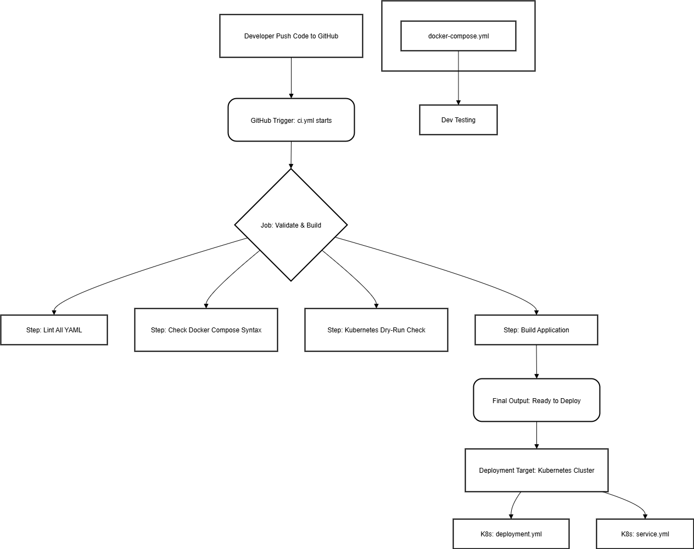

# CI/CD Project - Complete Pipeline

Project CI/CD แบบครบวงจร ที่รวมเอา GitHub Actions, Docker Compose และ Kubernetes เข้าด้วยกัน

## โครงสร้าง Project

```
├── .github/workflows/
│   └── ci.yml                    # GitHub Actions Workflow
├── k8s/
│   ├── deployment.yml            # Kubernetes Deployment
│   └── service.yml               # Kubernetes Service
├── docker-compose.yml            # Docker Compose Configuration
├── .yamllint.yml                 # YAML Lint Configuration
├── README.md                     # เอกสารนี้
└── Diagram.png                   # Diagram ความสัมพันธ์
```

## โจทย์ 1: GitHub Actions Workflow

### คำอธิบาย on: push และ on: pull_request

**`on: push`**
- เมื่อมีการ push โค้ดเข้าสู่ branch main จะทำให้ workflow ทำงานโดยอัตโนมัติ
- เหมาะสำหรับการตรวจสอบโค้ดที่จะเข้า production
- ช่วยให้มั่นใจว่าโค้ดที่ merge แล้วยังคงผ่านการทดสอบ

**`on: pull_request`**  
- เมื่อมีการสร้าง หรือ update pull request ที่จะ merge เข้า branch main
- ตรวจสอบโค้ดก่อนที่จะ merge เข้า main branch
- ช่วยป้องกันไม่ให้โค้ดที่มีปัญหาเข้าสู่ production

### คำอธิบาย Jobs และ Steps

**Jobs คือ**
- กลุ่มของงานที่ทำงานใน environment เดียวกัน (เช่น ubuntu-latest)
- สามารถทำงานแบบ parallel หรือ sequential ได้
- ในที่นี้เรามี job เดียวชื่อ `ci_process`

**Steps คือ**
- ขั้นตอนย่อยภายใน job แต่ละ job
- ทำงานเป็นลำดับจากบนลงล่าง
- แต่ละ step สามารถใช้ action หรือ run command ได้

### Steps ในโปรเจ็คนี้:
1. **Checkout Repository** - ดาวน์โหลดโค้ดจาก repository
2. **Lint YAML Files** - ตรวจสอบ syntax ของไฟล์ YAML ทั้งหมด (.github/workflows/ci.yml, docker-compose.yml, k8s/*.yml)
3. **Setup Docker** - เตรียม Docker environment สำหรับการทดสอบ
4. **Check Docker Compose** - ตรวจสอบ docker-compose.yml และ validate configuration
5. **Setup Kubectl** - เตรียม kubectl สำหรับทดสอบ Kubernetes
6. **Kubernetes Dry-Run** - ทดสอบ K8s manifests โดยไม่ deploy จริง
7. **Validate YAML Structure** - ตรวจสอบโครงสร้างและความครบถ้วนของไฟล์ YAML
8. **Build Application** - จำลองการ build แอปพลิเคชัน
9. **Notify** - แจ้งเตือนเมื่อ workflow เสร็จสิ้น

## โจทย์ 2: Docker Compose

### คำอธิบาย Components

**`services`**
- กำหนด containers ที่ต้องการรัน
- แต่ละ service จะกลายเป็น container หนึ่ง
- สามารถสื่อสารกันได้ผ่าน network ภายใน

**`ports`**
- ทำ port mapping จาก host เข้าสู่ container
- รูปแบบ: "host_port:container_port"
- ในที่นี้ port 8080 ของ host จะชี้ไปที่ port 80 ของ nginx

**`volumes`**  
- mount ไฟล์หรือโฟลเดอร์จาก host เข้าสู่ container
- ใช้สำหรับแชร์ข้อมูลระหว่าง host และ container
- ในที่นี้ mount โฟลเดอร์ปัจจุบันเข้าไปใน nginx

**`environment`**
- กำหนดค่า environment variables ภายใน container
- ใช้สำหรับ configuration ของ application
- ในที่นี้ใช้สำหรับตั้งรหัสผ่าน MySQL และชื่อ database

### การทำงานร่วมกับ Project

Docker Compose ช่วยให้เราสามารถ:
- รัน multi-container application ได้ง่าย
- จำลอง production environment ใน development
- ทดสอบการทำงานของ web server และ database ร่วมกัน
- ใช้ใน CI/CD pipeline สำหรับการทดสอบ

## โจทย์ 3: Kubernetes

### คำอธิบาย Deployment

**`Deployment`**
- จัดการการ deploy และ update ของ application
- รับประกันว่าจะมี Pod ทำงานตามจำนวนที่กำหนด
- สามารถทำ rolling update ได้โดยไม่มี downtime

**`replicas`**
- จำนวน Pod ที่ต้องการให้ทำงาน
- ในที่นี้ตั้งไว้ 2 replicas เพื่อ high availability
- ถ้า Pod ตายไป Kubernetes จะสร้างใหม่ให้อัตโนมัติ

**`selector`**
- เลือก Pod ที่ Deployment จะจัดการ
- ใช้ labels เป็นเกณฑ์ในการเลือก
- ต้องตรงกับ labels ใน template

**`template`**
- blueprint สำหรับสร้าง Pod
- กำหนด container image, ports และ configuration อื่นๆ
- Pod ที่สร้างจะมี labels ตามที่กำหนดไว้

### คำอธิบาย Service

**`Service`**
- ทำหน้าที่เป็น load balancer และ service discovery
- ให้ IP address และ DNS name ที่คงที่สำหรับ Pods
- ใน cluster สามารถเข้าถึงผ่านชื่อ service ได้

**`port`**
- port ที่ service จะ expose ให้ cluster อื่นๆ เข้าถึง
- เป็น port ของ service เอง

**`targetPort`**  
- port ของ Pod ที่ service จะส่ง traffic ไป
- ต้องตรงกับ containerPort ใน Deployment

**`NodePort`**
- ทำให้เข้าถึง service ได้จากภายนอก cluster
- Kubernetes จะ assign port ในช่วง 30000-32767
- ในที่นี้กำหนดเป็น 30080

### ความสัมพันธ์ระหว่าง Deployment และ Service

1. **Deployment** สร้าง Pods พร้อม labels `app: web-app, tier: frontend`
2. **Service** ใช้ selector เพื่อหา Pods ที่มี labels ตรงกัน
3. Service จะส่ง traffic ไปยัง Pods เหล่านั้นแบบ load balancing
4. เมื่อ Pod ตาย Deployment จะสร้างใหม่ Service จะส่ง traffic ไปหา Pod ใหม่อัตโนมัติ

## โจทย์ 4: การทำงานร่วมกันของ YAML Files

### การทำงานร่วมกัน

1. **GitHub Actions** (`ci.yml`)
   - ตรวจสอบ syntax ของไฟล์ YAML ทั้งหมด
   - ทดสอบ Docker Compose configuration
   - ทดสอบ Kubernetes manifests ด้วย dry-run

2. **Docker Compose** (`docker-compose.yml`)
   - ใช้สำหรับ development และ testing environment
   - รัน web server และ database ในเครื่อง
   - ใช้ใน CI pipeline สำหรับ integration testing

3. **Kubernetes** (`k8s/*.yml`)
   - ใช้สำหรับ production deployment
   - มีความ scalable และ reliable สูง
   - รองรับ high availability และ auto-scaling

### ลำดับขั้นตอนเมื่อ Push โค้ด

```
1. Developer push code → GitHub
2. GitHub Actions triggered โดยอัตโนมัติ
3. Checkout code จาก repository
4. Lint YAML files ทั้งหมด (ci.yml, docker-compose.yml, k8s/*.yml)
5. Setup Docker environment
6. Validate Docker Compose configuration (docker-compose config)
7. Setup Kubectl
8. Test Kubernetes manifests (kubectl --dry-run)
9. Validate YAML structure และตรวจสอบ services ครบถ้วน
10. Build application (จำลอง)
11. ถ้าผ่านทุก step → แจ้งว่า workflow สำเร็จ
12. ถ้า fail ขั้นตอนไหน → แจ้ง error และหยุดการทำงาน
```

### การตรวจสอบแต่ละไฟล์ YAML

**CI/CD Pipeline ตรวจสอบ:**
- ✅ `.github/workflows/ci.yml` - GitHub Actions workflow syntax
- ✅ `docker-compose.yml` - Docker Compose configuration และ services (web, db)
- ✅ `k8s/deployment.yml` - Kubernetes Deployment manifest
- ✅ `k8s/service.yml` - Kubernetes Service manifest
- ✅ `.yamllint.yml` - YAML linting rules configuration

### Flow การ Deploy

```
GitHub Actions (CI/CD) 
       ↓
Docker Compose (Development/Testing)
       ↓  
Kubernetes (Production)
```

## การใช้งาน

### รัน Docker Compose
```bash
docker-compose up -d
```
เข้าถึงได้ที่: http://localhost:8080

### Deploy ไป Kubernetes
```bash
kubectl apply -f k8s/
```
เข้าถึงได้ที่: http://node-ip:30080

### ดู Workflow Status
ไปที่ GitHub → Actions tab เพื่อดู CI/CD pipeline status

## Diagram



Diagram แสดงความสัมพันธ์ระหว่าง:
- GitHub Repository
- GitHub Actions CI/CD Pipeline  
- Docker Compose (Development)
- Kubernetes Cluster (Production)
- Load Balancer และ External Access